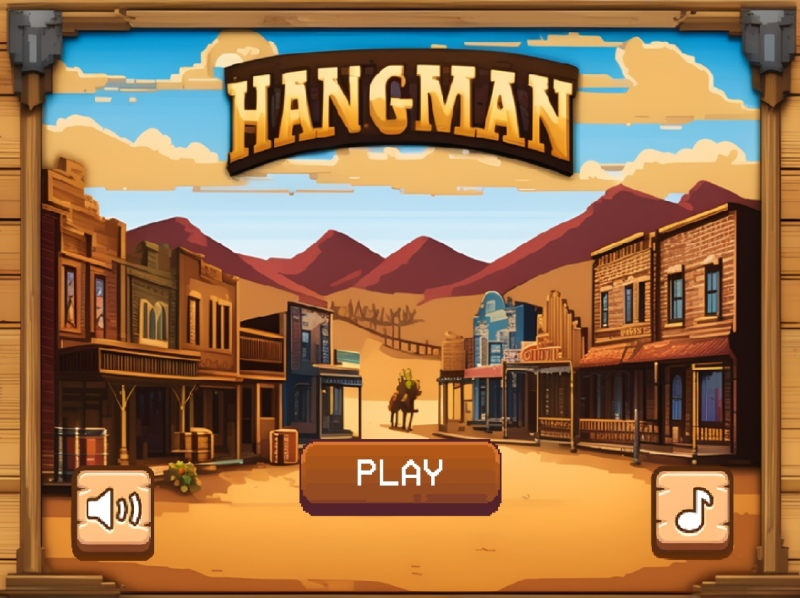
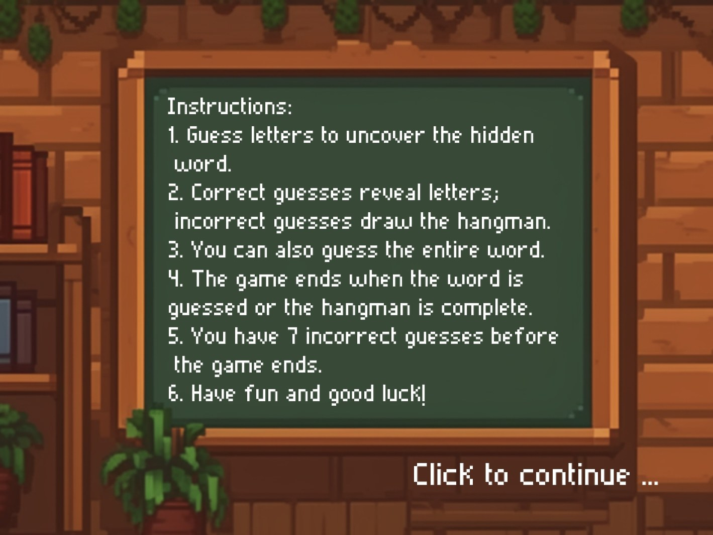
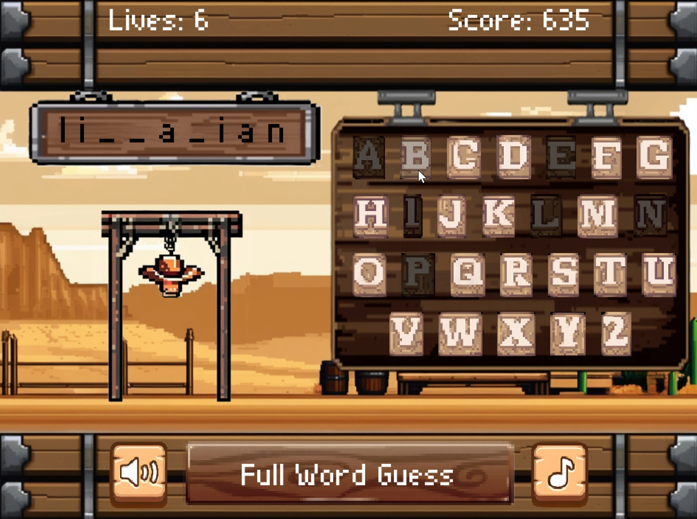

# Pygame Hangman Game

A feature-rich Hangman game built with Python and Pygame, featuring an Indiana Jones theme with custom graphics, sound effects, and music.

## Features

- **Multiple Difficulty Levels**: Easy (10-13 letters), Medium (7-9 letters), Hard (1-6 letters)
- **Full Word Guessing**: Option to guess the entire word for bonus points
- **Interactive UI**: Custom buttons with hover and click animations
- **Sound System**: Background music and sound effects with toggle controls
- **Score System**: Dynamic scoring based on time and mistakes
- **High Score Tracking**: Keeps track of your best performance
- **Animated Instructions**: Step-by-step tutorial with typing animation

## Screenshots





## Installation

1. **Clone the repository**:
   ```bash
   git clone https://github.com/yourusername/HangmanPygame.git
   cd HangmanPygame
   ```

2. **Install required dependencies**:
   ```bash
   pip install -r requirements.txt
   ```

3. **Run the game**:
   ```bash
   python src/main.py
   ```

## Requirements

- Python 3.7+
- Pygame 2.0+

## Game Controls

- **Mouse**: Navigate menus and click buttons
- **Keyboard**: Type letters to guess or use on-screen keyboard
- **Enter**: Submit full word guess
- **Backspace**: Delete characters when guessing full word

## Project Structure

```
pygame-hangman/
├── assets/
│   ├── images/
│   │   ├── buttons/     # All button PNGs
│   │   ├── hangman/     # Error1.*.png files
│   │   ├── ui/          # UI elements
│   │   └── screens/     # Screen backgrounds
│   ├── audio/
│   │   ├── music/       # Background music
│   │   └── sfx/         # Sound effects
│   └── fonts/           # PIXELADE.TTF
├── src/
│   └── main.py          # Main game file
├── data/
│   └── Dictionary.txt   # Word list
├── README.md
├── requirements.txt
└── .gitignore
```

## Development

This project was created as a Programming 11 final project, demonstrating:
- Object-oriented programming concepts
- Game state management
- Event handling
- File I/O operations
- Audio/visual integration

## License

This project is for educational purposes.

## Credits

**Developer**: Leonardo Nieto  
**Course**: Programming 11 Final Project  
**Date**: January 19, 2024  

### Assets
- Theme: Indiana Jones
- Font: PIXELADE.TTF
- Custom graphics and sound effects included
